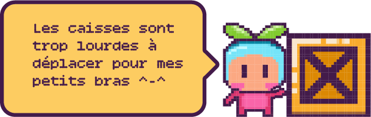

# 🎮 Sokobana - Vanilla JavaScript

## 🧩 Qu'est-ce que Sokoban ?

Sokoban est un jeu de réflexion inventé par **Hiroyuki Imabayashi** en 1982. Le
ou la joueuse incarne un gardien d'entrepôt dont l'objectif est d'organiser des
caisses en les plaçant sur des cases cibles.

🔹 **Règles du jeu** :

- Le gardien peut se déplacer dans les quatre directions.
- Il peut **pousser** une seule caisse à la fois (mais pas la tirer).
- Une fois toutes les caisses rangées correctement, le niveau est complété et le
  ou la joueuse passe au suivant.

---

## 🎯 Objectifs du projet

Ce projet a pour but d'explorer et de pratiquer les concepts suivants en
**JavaScript Vanilla** :

✅ **Manipulation des classes** 📚\
✅ **Utilisation des méthodes et des propriétés de classe** ⚙️\
✅ **Intégration des classes avec la manipulation du DOM** 🖥️

---

## 👩‍💻 Contributeurs

Ce projet a été conçu et codé avec ❤️ par :

- [@TekGeek_dev](https://github.com/TekGeekdev)
- [@patrihow](https://github.com/patrihow)
